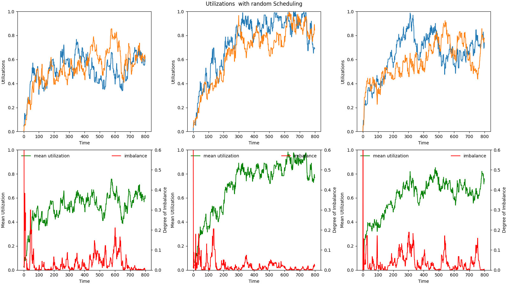

# Simulator for Different Scheduling Protocols
Distributed Systems Final Project

To use: ```python simulator.py -o <output> -s <scheduler> -t <timesteps>```

## Experiment 1: Build Simulator to Match Baselines in Paper

Generates plots that match the baselines provided in the paper we studied so that we have metrics to compare to.

Here are the examples so far:

# Random Scheduling


# First Fit Scheduling


# Least Load Scheduling


# Round Robin Scheduling


## Experiment 2: Proposed Instant-Gratification Scheduler
I thought this would be an interesting baseline to compare to. The instant gratification scheduler takes the same reward function and parameters as the reinforcement learning model. Instead of taking training episodes and trying to build a neural network representing a Q table to maximize rewards over the lifetime, this scheduler simply takes the action the provides the highest reward in a given moment. (The restriction here is that it WILL choose to schedule something, no delaying. Since it is scheduling the same job, the total utilization increase is the same for every action. We could try delaying jobs a random number of time steps (Maybe roll a random integer and move it back that number of steps so we can keep the integer return. Could make for an interesting experiment. Currently this means alpha does nothing.) Varying beta controls the difference within the cluster while gama controls the difference between clusters. Note that since there is no lookahead, raising these parameters will not necessarily create the desired outcome in the same way as reinforcement learning. However, I think this sort of "Stupid" model is a good comparison for something more sophisticated like the reinforcement learning model.

# Instant Gratification Schedule w/ Beta = 1, Gamma = 1


# Instant Gratification Schedule w/ Beta = 1, Gamma = 0


# Instant Gratification Schedule w/ Beta = 0, Gamma = 1


Note that what really matters is not the values of the parameters, so much as the ratio between them.

## Experiment 3: Timing
TODO: I noticed that the scheduler that considers a reward function takes quite a bit longer to simulate. I think this might also be true of the reinforcement learning model. As the scheduler is meant for online scheduling, timeliness could actually be a concern if there is a great number of jobs and delay is important. Will want to run some time series tests and include a table for the paper.
